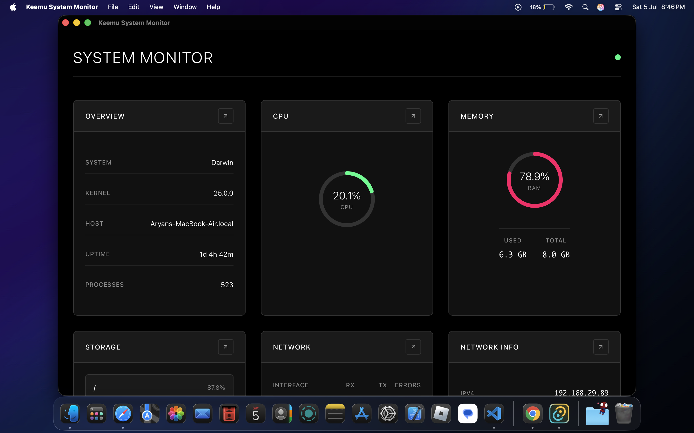
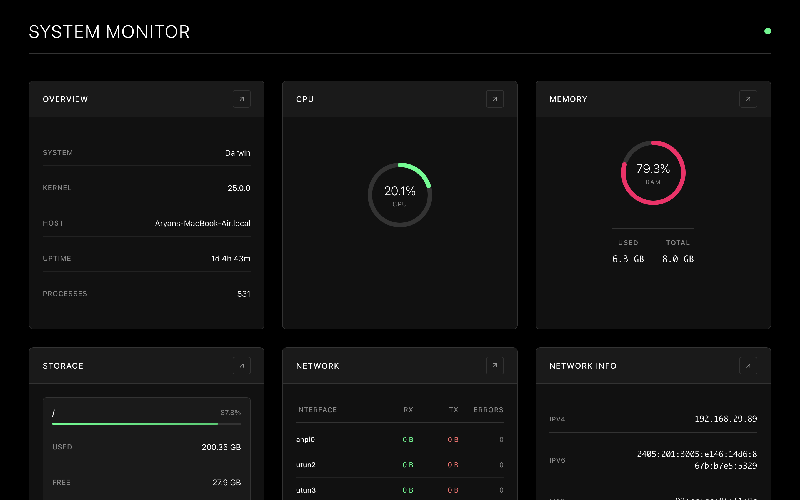
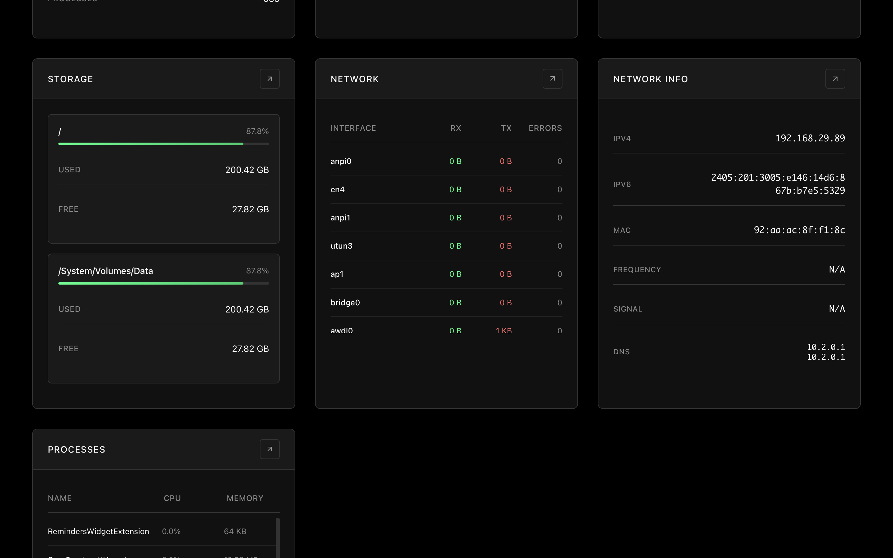
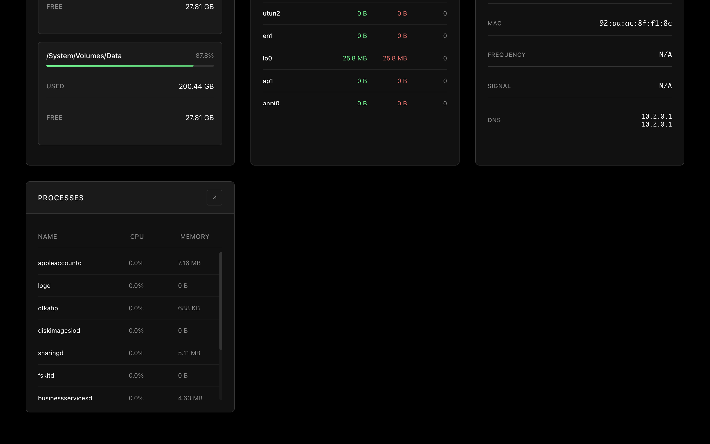
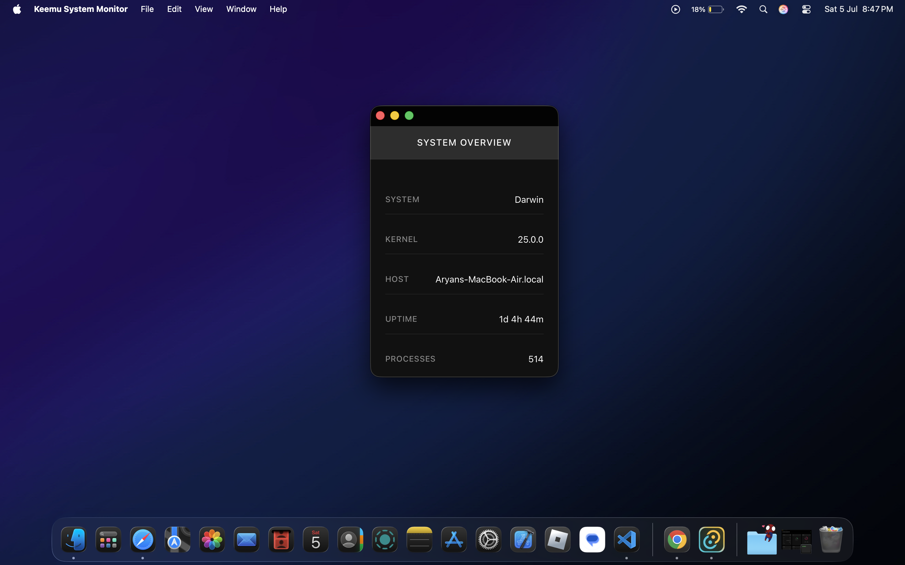

#  Keemu System Monitor

A modern, real-time system monitoring application built with Tauri, providing comprehensive insights into your system's performance and resource usage.

##  Features

- **Real-time Monitoring**: Live updates of CPU, memory, disk usage and network statistics
- **Process Management**: View top processes by CPU usage
- **System Information**: Display hostname, OS, kernel version, and uptime
- **Modern UI**: Beautiful glass-morphism design with responsive layout
- **Cross-platform**: Built with Tauri for optimal performance on macOS, Windows, and Linux

##  Screenshots

### Main Dashboard

*Real-time system monitoring dashboard with CPU, memory, and disk usage*

### System Information

*Detailed system information including OS, kernel version, and uptime*

### Storage and Network Management

*Storage used by disks and network information*

### Process List

*Top processes by CPU usage with detailed resource consumption*

### Easy to separate

*Users can get a separate window for anything*

##  Getting Started

### Prerequisites

- [Rust](https://rustup.rs/) (latest stable version)
- [Tauri](https://tauri.app/develop/getting-started/) (Cross-platform framework)

### Installation

1. Clone the repository:
   ```bash
   git clone https://github.com/aryansrao/keemu
   ```
   ```bash
   cd keemu
   ```

2. Run in development mode:
   ```bash
   cargo tauri dev
   ```

3. Build for production:
   ```bash
   cargo tauri build
   ```

##  System Metrics

- **CPU Usage**: Real-time CPU utilization percentage
- **Memory Usage**: RAM consumption with total/used breakdown
- **Disk Usage**: Storage utilization for all mounted drives
- **Process List**: Top 10 processes by CPU usage
- **System Info**: Hostname, OS version, kernel, and uptime
- **Network Info**: Network interfaces and their statuses

##  Technology Stack

- **Frontend**: Vanilla HTML, CSS, JavaScript
- **Backend**: Rust with Tauri framework
- **System Info**: sysinfo crate for cross-platform system monitoring
- **UI Design**: Pure black minimalistic design with clean and user friendly UI


## Recommended IDE Setup

- [VS Code](https://code.visualstudio.com/) + [Tauri](https://marketplace.visualstudio.com/items?itemName=tauri-apps.tauri-vscode) + [rust-analyzer](https://marketplace.visualstudio.com/items?itemName=rust-lang.rust-analyzer)
